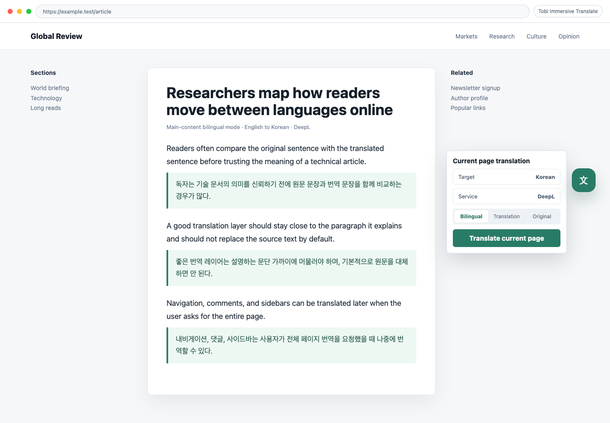
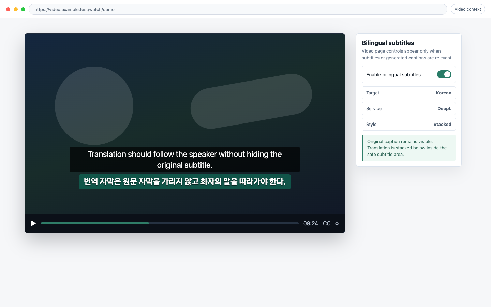

# Production-alignment verification goals

작성일: 2026-07-06 KST

이 문서는 `production-product-memory.md`의 제품 메모리를 MCP가 검증할 수 있는 목표 계약으로 바꾼다. 현재 v1의 핵심은 popup/settings 창이 아니라 오른쪽 floating toggle과 영상 자동 자막 번역이다.

## 검증 원칙

- 공식 제품을 1:1 복제하지 않는다. 검증 대상은 행동, 정보 구조, 사용자 여정이다.
- 웹페이지 번역은 오른쪽 floating toggle 클릭으로 시작되어야 한다.
- 영상 번역은 provider enabled + video context에서 popup 클릭 없이 자동 시작되어야 한다.
- popup은 `Minimal Status`여야 하며 설정 창이나 command center가 아니어야 한다.
- Docker/LibreTranslate는 기본 provider로 동작하지만 raw endpoint UI가 첫 화면을 지배하면 실패다.
- 사용자-facing UI copy는 한국어 중심이다. 참고 이미지에 중국어 UI가 있더라도 실제 UI copy에는 중국어 문구를 넣지 않는다.
- 모든 screenshot gate는 파일 존재뿐 아니라 selector visibility, bounding box, overlap, first-screen priority를 함께 확인한다.

## MCP 검증 산출물

MCP 검증은 다음 산출물을 남긴다.

- `test-results/qa-evidence/screenshots/production-alignment/popup-minimal-status.png`
- `test-results/qa-evidence/screenshots/production-alignment/article-floating-toggle-translation.png`
- `test-results/qa-evidence/screenshots/production-alignment/go-docs-floating-webpage-translation.png`
- `test-results/qa-evidence/screenshots/production-alignment/youtube-auto-subtitle-translation.png`
- `test-results/qa-evidence/screenshots/production-alignment/docker-go-docs-floating-translation.png`
- `test-results/qa-evidence/screenshots/production-alignment/docker-youtube-auto-subtitle-translation.png`
- `test-results/qa-evidence/screenshots/production-alignment/real-go-official-docs-floating-translation.png`
- `test-results/qa-evidence/screenshots/production-alignment/real-youtube-auto-subtitle-translation.png`
- `test-results/qa-evidence/metadata.json`
- `test-results/qa-evidence/pr-summary.md`

`metadata.json`은 각 scenario title, status, duration, evidence path, failure reason을 포함해야 한다.

## 2026-07-06 KST 실행 결과

통과한 명령:

- `pnpm --filter @jongminchung/immersive-translate run typecheck`
- `pnpm --filter @jongminchung/immersive-translate run test:unit`
- `pnpm --filter @jongminchung/immersive-translate run build`
- `pnpm --filter @jongminchung/immersive-translate run verify:artifacts`
- `pnpm --filter @jongminchung/immersive-translate run test:live`
- `REAL_TRANSLATION_QA=1 LOCAL_TRANSLATION_ENDPOINT=http://127.0.0.1:5000/translate pnpm --filter @jongminchung/immersive-translate run test:live`
- `REAL_NETWORK_QA=1 LOCAL_TRANSLATION_ENDPOINT=http://127.0.0.1:5000/translate pnpm --filter @jongminchung/immersive-translate run test:live`
- `REAL_TRANSLATION_QA=1 REAL_NETWORK_QA=1 LOCAL_TRANSLATION_ENDPOINT=http://127.0.0.1:5000/translate pnpm --filter @jongminchung/immersive-translate run test:live`
- `pnpm run check`

최종 통합 live QA 결과:

- fixture + Docker + actual Go official docs: 8 passed.
- Docker compose service `libretranslate`는 `127.0.0.1:5000`에서 healthy 상태다.
- 최종 metadata: `test-results/qa-evidence/metadata.json`.
- 자동 검증은 package metadata, MV3 manifest, content script, built asset 금지 문자열, `페이지 번역 켜기` tooltip, screenshot evidence를 모두 확인한다.

생성된 핵심 screenshot evidence:

- `test-results/qa-evidence/screenshots/production-alignment/popup-minimal-status.png`
- `test-results/qa-evidence/screenshots/production-alignment/article-floating-toggle-translation.png`
- `test-results/qa-evidence/screenshots/production-alignment/go-docs-floating-webpage-translation.png`
- `test-results/qa-evidence/screenshots/production-alignment/youtube-auto-subtitle-translation.png`
- `test-results/qa-evidence/screenshots/production-alignment/docker-go-docs-floating-translation.png`
- `test-results/qa-evidence/screenshots/production-alignment/docker-youtube-auto-subtitle-translation.png`
- `test-results/qa-evidence/screenshots/production-alignment/real-go-official-docs-floating-translation.png`
- `test-results/qa-evidence/screenshots/production-alignment/real-youtube-auto-subtitle-translation.png`

실제 YouTube caption hard gate:

- `REAL_YOUTUBE_CAPTION_QA=1 REAL_YOUTUBE_URL='https://www.youtube.com/watch?v=IroPQ150F6c' LOCAL_TRANSLATION_ENDPOINT=http://127.0.0.1:5000/translate pnpm exec playwright test -c playwright.config.ts tests/live/immersive-translate.spec.ts -g 'actual YouTube'`는 2026-07-06 KST 기준 통과했다.
- 기존 실패 문구는 `YouTube caption payload is empty.`였다. 원인은 `timedtext` 빈 payload 이후 새 YouTube transcript DOM인 `transcript-segment-view-model`을 parser가 읽지 못한 것이다.
- 현재 hard gate는 popup이나 page translation fallback 없이 실제 YouTube transcript cue를 수집하고, Docker 번역 결과를 영상 위 이중 자막 overlay로 표시해야 통과한다.
- `timedtext`와 Innertube transcript API는 여전히 불안정한 fallback이다. 실제 pass 기준은 접근 가능한 YouTube transcript DOM 또는 player caption DOM에서 온 원문 cue와 한국어 번역 overlay다.

## Reference Screenshot Baselines

아래 이미지는 공식 제품 복제가 아니라 검증 기준을 설명하는 schematic reference다. golden image 비교가 아니라 viewport, 정보 우선순위, 요소 위치, visibility, overlap 기준으로 사용한다.

### Webpage Translation Reference

기준 viewport: `1440x1000`.

필수 목표:

- 본문 article이 중심이다.
- 원문 paragraph 바로 아래 또는 heading 옆에 번역 block이 붙는다.
- 원문은 사라지지 않는다.
- 오른쪽 floating control은 본문 텍스트를 영구적으로 가리지 않는다.
- popup/settings 창을 열지 않아도 번역이 시작된다.
- `페이지 번역 켜기` tooltip이 보인다.

MCP screenshot assertions:

- `article-floating-toggle-translation.png`는 `1440x1000` fixture에서 생성한다.
- `[data-testid="floating-translate-control"]`가 visible이다.
- floating control의 tooltip과 접근성 이름은 `페이지 번역 켜기`다.
- 첫 클릭 전 `[data-testid="translated-block"]`는 없다.
- 첫 클릭 후 `[data-testid="source-block"]`와 `[data-testid="translated-block"]`가 모두 visible이다.
- translated block의 top은 대응 source block 근처에 있어야 한다.
- floating control bounding box는 viewport 안에 있어야 한다.
- floating control이 source/translated block과 읽기 불가능하게 overlap하면 실패다.

### Video Translation Reference

기준 viewport: `1440x900`.

필수 목표:

- 영상 player가 중심이다.
- popup 클릭 없이 bilingual subtitle overlay가 자동 렌더링된다.
- dark translucent subtitle block 안에 원문 1줄과 번역 1줄이 함께 보인다.
- 원문 자막은 번역 자막보다 먼저 보인다.
- 자막 block은 player control bar와 겹치지 않는다.

MCP screenshot assertions:

- `youtube-auto-subtitle-translation.png`는 `1440x900` YouTube-style fixture에서 생성한다.
- `[data-testid="video-auto-subtitle-status"]`가 Render 상태를 가진다.
- `[data-testid="caption-original-line"]`와 `[data-testid="caption-translated-line"]`가 모두 visible이다.
- original line의 y 좌표는 translated line보다 작아야 한다.
- caption container는 viewport 안에 있고 영상 주요 영역을 과하게 가리지 않아야 한다.

## G01. Minimal Popup

목표: popup은 설정 창이 아니라 상태판이다.

필수 assert:

- `#immersive-translate-popup`가 visible이다.
- `[data-testid="popup-current-page-status"]`가 visible이다.
- `[data-testid="popup-floating-toggle-guidance"]`가 visible이고 오른쪽 번역 버튼 안내를 포함한다.
- `[data-testid="popup-provider-status"]`가 visible이고 `Default Docker` 상태를 표시한다.
- 제거 대상 selector가 popup에 없어야 한다:
  - `[data-testid="translation-service-select"]`
  - `[data-testid="target-language-select"]`
  - `[data-testid="provider-settings-local-endpoint"]`
  - `[data-testid="document-tool-entry"]`
  - `[data-testid="more-menu"]`
- `PDF/ePub`, `More`, raw endpoint 입력은 first screen에 없어야 한다.
- gear affordance를 눌러도 settings panel이 열리면 실패다.

## G02. Floating Toggle Trigger

목표: 웹페이지 번역 실행은 오른쪽 floating toggle이 담당한다.

필수 assert:

- article fixture 로드 후 popup을 열지 않아도 `[data-testid="floating-translate-control"]`가 visible이다.
- floating control은 최소 `44x44px`이고 `페이지 번역 켜기` tooltip과 접근성 이름을 제공한다.
- 주입 UI는 열린 Shadow DOM에 한 번만 마운트되고 host 문서의 theme 속성을 변경하지 않는다.
- 첫 클릭 후 background translation request는 sender tab에만 적용된다.
- 번역 완료 후 클릭하면 translated block이 숨겨지고, 다시 클릭하면 보인다.

## G03. Webpage Translation Blocks

목표: 일반 웹페이지는 원문과 번역문이 함께 보이는 이중 언어 읽기 상태가 된다.

필수 assert:

- `[data-testid="source-block"]`가 원문 본문에 붙는다.
- `[data-testid="translated-block"]`가 번역 본문에 붙는다.
- heading 번역은 `[data-webpage-inline-translation="true"]`로 구분된다.
- paragraph 번역은 `[data-webpage-paragraph-translation="true"]`로 구분된다.
- navigation/control/code/pre/hidden text는 기본 smart content 번역에서 우선 제외된다.
- Docker provider 또는 deterministic mock provider response가 실제 translated block text에 반영된다.

## G04. Go Official Docs Gate

목표: Go 공식문서 계열 페이지가 floating toggle로 번역된다.

Fixture 필수 assert:

- `go-docs-floating-webpage-translation.png`를 생성한다.
- `Go 프로그래밍 언어는` 같은 한국어 번역문이 visible이다.
- Go docs navigation은 유지된다.
- inline heading translation과 paragraph translation selector가 모두 visible이다.

Actual network 필수 assert:

- `REAL_NETWORK_QA=1`에서 `https://go.dev/doc/effective_go`를 연다.
- popup을 열지 않고 floating toggle을 클릭한다.
- `[data-testid="translated-block"]`가 visible이다.
- translated text에 한국어가 포함된다.
- `real-go-official-docs-floating-translation.png`를 생성한다.

## G05. Video Auto Subtitle Gate

목표: 영상 페이지는 popup 클릭 없이 자동 이중 언어 자막을 렌더링한다.

Fixture 필수 assert:

- YouTube-style fixture 진입 후 `[data-testid="video-auto-subtitle-status"]`가 Render 상태가 된다.
- `[data-testid="caption-original-line"]`와 `[data-testid="caption-translated-line"]`가 visible이다.
- 번역 자막에 한국어가 포함된다.
- `youtube-auto-subtitle-translation.png`를 생성한다.

Actual YouTube 필수 assert:

- `REAL_YOUTUBE_CAPTION_QA=1`에서 실제 YouTube watch page를 연다.
- popup이나 page translation fallback 없이 자동 자막 번역을 시도한다.
- `[data-testid="caption-translated-line"]`가 visible이고 한국어를 포함해야 한다.
- 실패 시 page translation fallback으로 pass 처리하지 않고 caption QA 실패로 기록한다.

## G06. Default Docker Provider

목표: provider는 설정 UI 없이 Default Docker로 동작한다.

필수 assert:

- `DEFAULT_LOCAL_TRANSLATION_SETTINGS.enabled === true`.
- endpoint는 `http://127.0.0.1:5000/translate`.
- source는 `auto`.
- target은 `ko-en`.
- Docker compose service가 떠 있으면 article fixture와 YouTube-style fixture가 실제 한국어로 번역된다.
- popup first screen에는 raw endpoint input이 없다.

## G07. User-facing Copy Guard

목표: 사용자-facing UI에 중국어와 개발/QA copy가 남지 않는다.

필수 assert:

- built popup/content asset에 Han script 문자가 없다. 한국어 Hangul은 허용한다.
- built popup/content asset에 `translation-service-select`, `target-language-select`, `provider-settings-local-endpoint`, `document-tool-entry`, `more-menu`가 없다.
- built popup/content asset에 `bridge`, `smoke translation`, `install bridge`, `active-tab bridge`가 visible UI copy로 남지 않는다.
- built content asset에 `페이지 번역 켜기`가 존재한다.

## G08. Build Artifact And Manifest Integrity

목표: 검증은 실제 extension build 산출물을 대상으로 한다.

필수 assert:

- `pnpm --filter @jongminchung/immersive-translate run build`가 성공한다.
- `.output/chrome-mv3/manifest.json`이 존재한다.
- manifest version은 3이다.
- manifest name은 `Tobi Immersive Translate`이다.
- content script 자동 주입 경로가 존재한다.
- popup entry가 존재한다.
- required built assets가 모두 존재하고 0 byte가 아니다.

## G09. MCP File/DOM/Screenshot Verification

목표: MCP `node_repl`이 최종 산출물을 독립적으로 검증한다.

필수 assert:

- package metadata:
  - package name은 `@jongminchung/immersive-translate`.
  - `private: true`.
  - document archive parser dependency가 없다.
  - 이관 전 shared translation core dependency/import가 없다.
- grep guard:
  - target 전체에 이관 전 translation core package alias가 없다.
  - target 전체에 repo 외부 원본 경로 참조가 없다.
- manifest guard:
  - MV3.
  - content script 또는 equivalent auto-injection path.
  - required files present.
  - WXT starter asset이 build와 zip에 없다.
- screenshot guard:
  - `popup-minimal-status.png`.
  - `article-floating-toggle-translation.png`.
  - `go-docs-floating-webpage-translation.png`.
  - `youtube-auto-subtitle-translation.png`.
  - Docker screenshots when `REAL_TRANSLATION_QA=1` is run.

## MCP 실행 순서

1. `pnpm install`
2. `pnpm --filter @jongminchung/immersive-translate run typecheck`
3. `pnpm --filter @jongminchung/immersive-translate run test:unit`
4. `pnpm --filter @jongminchung/immersive-translate run build`
5. `pnpm --filter @jongminchung/immersive-translate run verify:artifacts`
6. `pnpm --filter @jongminchung/immersive-translate run test:live`
7. `REAL_TRANSLATION_QA=1 LOCAL_TRANSLATION_ENDPOINT=http://127.0.0.1:5000/translate pnpm --filter @jongminchung/immersive-translate run test:live`
8. `REAL_NETWORK_QA=1 LOCAL_TRANSLATION_ENDPOINT=http://127.0.0.1:5000/translate pnpm --filter @jongminchung/immersive-translate run test:live`
9. 필요 시 `REAL_YOUTUBE_CAPTION_QA=1 LOCAL_TRANSLATION_ENDPOINT=http://127.0.0.1:5000/translate pnpm --filter @jongminchung/immersive-translate run test:live`
10. MCP `node_repl` file/build/screenshot 검증

## 최소 통과선

이번 v1 milestone의 최소 통과선은 다음이다.

- G01, G02, G03, G04 fixture, G05 fixture, G06, G07, G08, G09는 반드시 pass.
- 실제 Go official docs는 네트워크가 허용되면 pass해야 한다.
- 실제 YouTube caption QA는 fallback 없이 실행하고, 실패 시 caption 제약으로 명확히 기록한다.
- 어떤 경우에도 큰 popup settings 창이나 중국어 tooltip이 보이면 production-alignment 실패다.
