# OpenAI Developer Blog 이미지 예시

- 수집 기준일: `2026-09-03`
- 출처: [OpenAI Developer Blog](https://developers.openai.com/blog)
- 범위: 수집 기준일에 Blog 목록에 노출된 전체 글 26개와 각 대표 이미지
- 보관 방식: 원본 `PNG` 또는 `WebP`를 리사이즈, 재압축, 색상 변환 없이 저장함
- 사용 범위: 배포 자산이 아닌 내부 아트 디렉션 참고 자료로만 사용함
- 참고 원칙: 구성·재질·조명·편집 톤만 참고하며 텍스트, 로고, 고유 UI, 식별 가능한 구성을 복제하지 않음

## 수집 목록

| 로컬 미리보기                                                                                                            | 글 제목과 공식 링크                                                                                                                                  | 원본 이미지 URL                                                                                                   |
| ------------------------------------------------------------------------------------------------------------------------ | ---------------------------------------------------------------------------------------------------------------------------------------------------- | ----------------------------------------------------------------------------------------------------------------- |
|                                       | [15 lessons learned building ChatGPT Apps](https://developers.openai.com/blog/15-lessons-building-chatgpt-apps)                                      | [원본 PNG](https://developers.openai.com/images/blog/15-lessons-chatgpt-apps.png)                                 |
|                | [Automating repetitive work at OpenAI with Codex](https://developers.openai.com/blog/automating-repetitive-work-at-openai-with-codex)                | [원본 WebP](https://developers.openai.com/images/blog/automating-repetitive-work-at-openai-with-codex/cover.webp) |
| 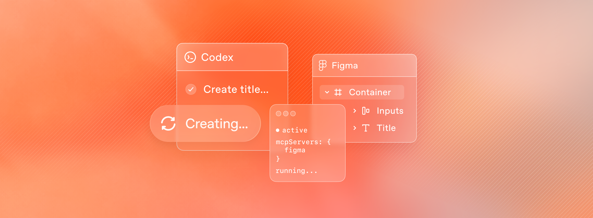                          | [Building frontend UIs with Codex and Figma](https://developers.openai.com/blog/building-frontend-uis-with-codex-and-figma)                          | [원본 PNG](https://developers.openai.com/images/blog/building-frontend-uis-with-codex-and-figma.png)              |
| 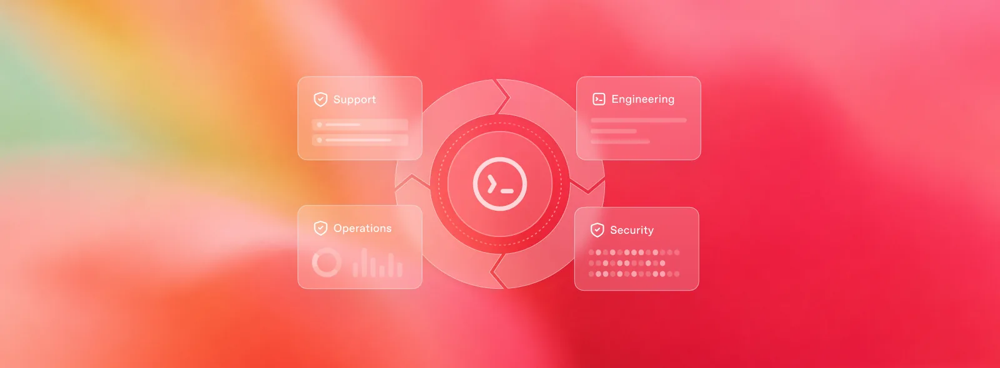                                                                       | [Codex as a platform: build on the open agent harness](https://developers.openai.com/blog/codex-as-a-platform)                                       | [원본 WebP](https://developers.openai.com/images/blog/codex-as-a-platform-cover.webp)                             |
|                                           | [Custom Code Review rules for Codex](https://developers.openai.com/blog/custom-code-review-rules-for-codex)                                          | [원본 PNG](https://developers.openai.com/images/blog/codex-custom-code-review-rules.png)                          |
| 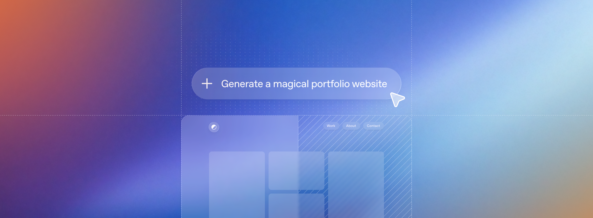                        | [Designing delightful frontends with GPT-5.4](https://developers.openai.com/blog/designing-delightful-frontends-with-gpt-5-4)                        | [원본 PNG](https://developers.openai.com/images/blog/designing-beautiful-frontends.png)                           |
|                                                                | [Developer notes on the Realtime API](https://developers.openai.com/blog/realtime-api)                                                               | [원본 PNG](https://developers.openai.com/images/blog/agent-online.png)                                            |
| 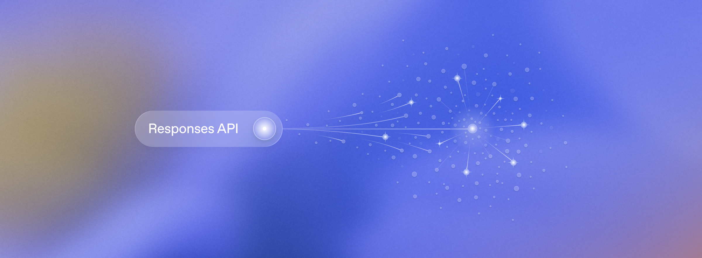                                                                 | [From prompts to products: One year of Responses](https://developers.openai.com/blog/one-year-of-responses)                                          | [원본 PNG](https://developers.openai.com/images/blog/one-year-responses.png)                                      |
|                                                                                             | [Hello, world!](https://developers.openai.com/blog/intro)                                                                                            | [원본 PNG](https://developers.openai.com/images/blog/hello-world.png)                                             |
| 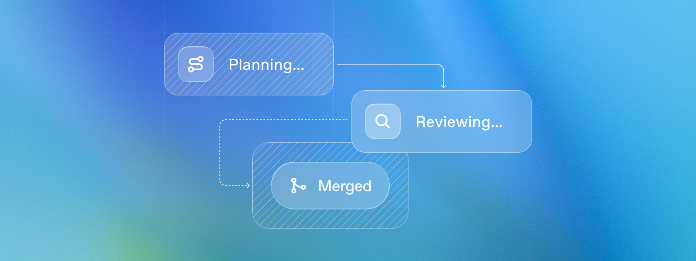                                                               | [How Codex ran OpenAI DevDay 2025](https://developers.openai.com/blog/codex-at-devday)                                                               | [원본 PNG](https://developers.openai.com/images/blog/codex-at-devday.png)                                         |
|             | [How Perplexity Brought Voice Search to Millions Using the Realtime API](https://developers.openai.com/blog/realtime-perplexity-computer)            | [원본 PNG](https://developers.openai.com/images/blog/realtime-perplexity-computer.png)                            |
| 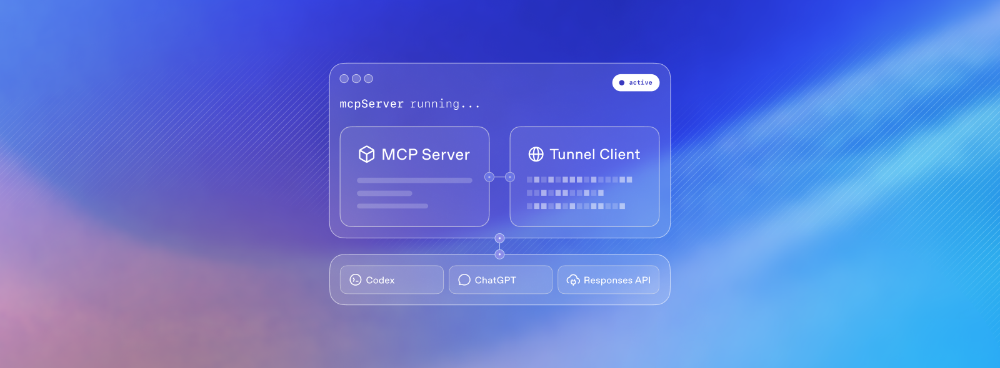 | [Making private MCP servers reachable without making them public](https://developers.openai.com/blog/connect-private-mcp-servers-to-openai-products) | [원본 PNG](https://developers.openai.com/images/blog/connect-private-mcp-servers-safely.png)                      |
|                        | [Mastering remote engineering work from your phone](https://developers.openai.com/blog/mastering-codex-remote-for-engineering)                       | [원본 PNG](https://developers.openai.com/images/blog/mastering-codex-remote-for-engineering.png)                  |
| 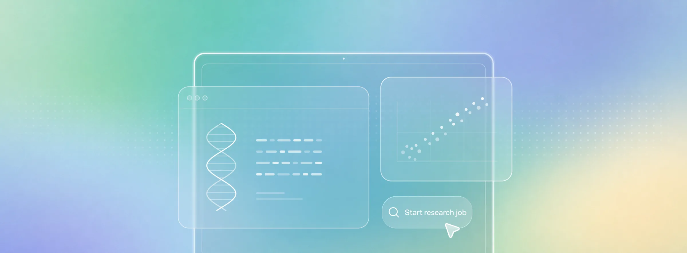                                                                    | [Meet Rosalind Workbench: Empowering every scientist to be their own research team](https://developers.openai.com/blog/rosalind-workbench)           | [원본 WebP](https://developers.openai.com/images/blog/rosalind-workbench/cover.webp)                              |
|                                                       | [Meet the winners of OpenAI Build Week](https://developers.openai.com/blog/build-week-winners)                                                       | [원본 WebP](https://developers.openai.com/images/blog/build-week-winners/cover.webp)                              |
|                                                        | [OpenAI for Developers in 2025](https://developers.openai.com/blog/openai-for-developers-2025)                                                       | [원본 PNG](https://developers.openai.com/images/blog/openai-for-devs-2025.png)                                    |
|                                             | [Run long horizon tasks with Codex](https://developers.openai.com/blog/run-long-horizon-tasks-with-codex)                                            | [원본 PNG](https://developers.openai.com/images/blog/run-long-horizon-tasks-with-codex.png)                       |
| 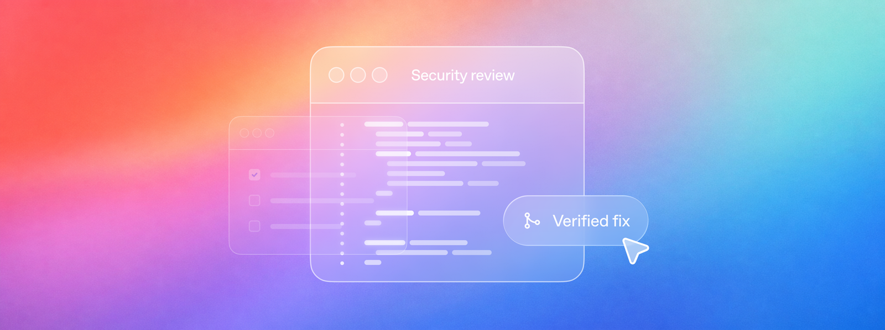                                    | [Scaling cyber defenders with Daybreak](https://developers.openai.com/blog/scaling-cyber-defenders-with-daybreak)                                    | [원본 PNG](https://developers.openai.com/images/blog/scaling-cyber-defenders-with-daybreak/cover.png)             |
| 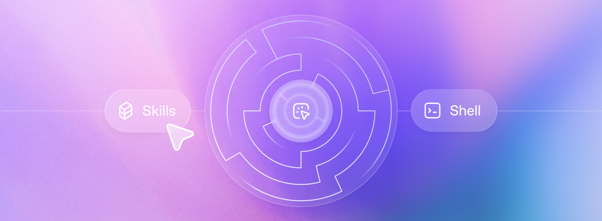                                                                      | [Shell + Skills + Compaction: Tips for long-running agents that do real work](https://developers.openai.com/blog/skills-shell-tips)                  | [원본 PNG](https://developers.openai.com/images/blog/skills-shell-tips.png)                                       |
| 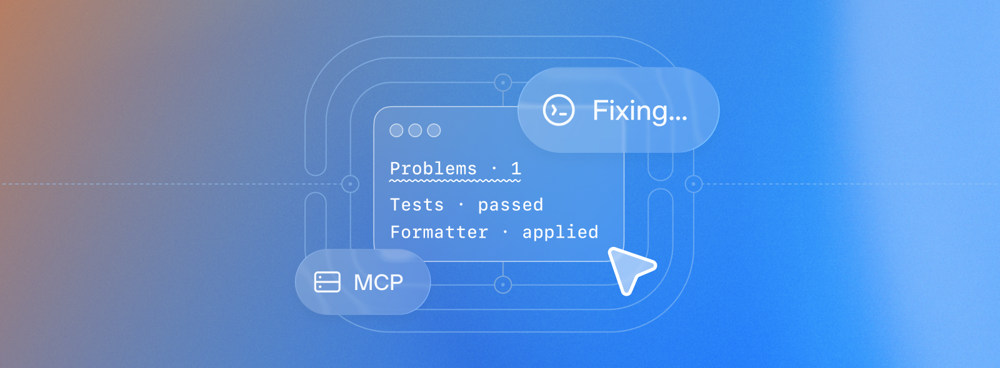                            | [Supercharging Codex with JetBrains MCP at Skyscanner](https://developers.openai.com/blog/skyscanner-codex-jetbrains-mcp)                            | [원본 PNG](https://developers.openai.com/images/blog/codex-jetbrains.png)                                         |
| 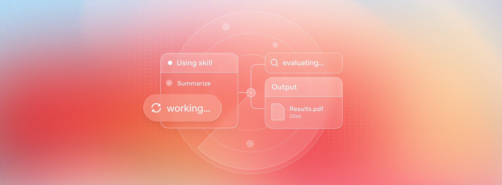                                                     | [Testing Agent Skills Systematically with Evals](https://developers.openai.com/blog/eval-skills)                                                     | [원본 PNG](https://developers.openai.com/images/blog/eval-skills.png)                                             |
| 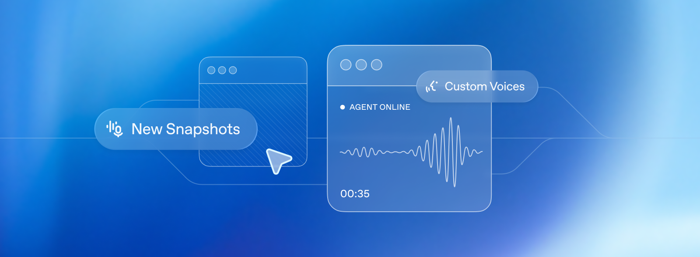                                               | [Updates for developers building with voice](https://developers.openai.com/blog/updates-audio-models)                                                | [원본 WebP](https://developers.openai.com/images/blog/updates-audio-blog.webp)                                    |
| 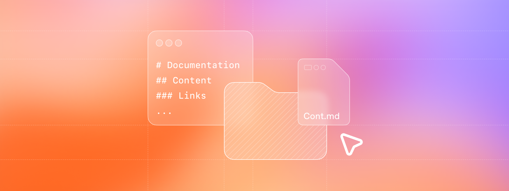                                      | [Using Codex for education at Dagster Labs](https://developers.openai.com/blog/codex-for-documentation-dagster)                                      | [원본 PNG](https://developers.openai.com/images/blog/codex-for-documentation-dagster.png)                         |
|                                                    | [Using skills to accelerate OSS maintenance](https://developers.openai.com/blog/skills-agents-sdk)                                                   | [원본 PNG](https://developers.openai.com/images/blog/skills-agents-sdk.png)                                       |
|                                                   | [What makes a great ChatGPT app](https://developers.openai.com/blog/what-makes-a-great-chatgpt-app)                                                  | [원본 PNG](https://developers.openai.com/images/blog/apps-blog-visual.png)                                        |
| 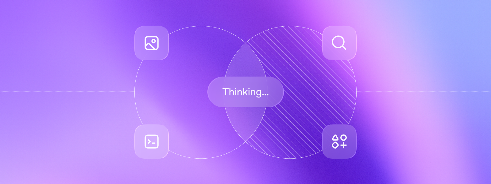                                                                   | [Why we built the Responses API](https://developers.openai.com/blog/responses-api)                                                                   | [원본 PNG](https://developers.openai.com/images/blog/responses-api.png)                                           |
