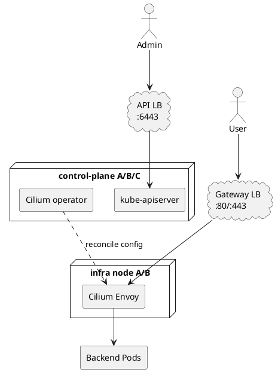

## Key takeaways

- **The API-server entry point and application Gateway entry point need separate ports, addresses, health checks, and failure domains**
- **A production baseline sends external application traffic to dedicated infra or worker nodes rather than control-plane nodes**
- **The programmed Envoy data path can have a different failure lifecycle from the Kubernetes API and Cilium operator**
- **If control-plane nodes must receive Gateway traffic, verify scheduling, Envoy readiness, port conflicts, and security groups explicitly**
- **High availability requires redundant external entry, Envoy nodes, and backends across failure domains, not merely three control-plane nodes**

## Separate two load-balancing boundaries

- **The API LB serves cluster management, while the Gateway LB serves application users**
  - The API LB checks control-plane nodes on `6443/TCP` and `/readyz`
  - The Gateway LB checks ingress nodes on `80/443` through an application health Route
  - Combining both roles into one VIP or target group couples access policy and incident diagnosis



- **Use separate names and certificates for the two roles**
  - `api.cluster.example.com` belongs in kubeconfig and Cilium `k8sServiceHost`
  - `app.example.com` belongs to the Gateway listener and user-facing certificate
  - Never reuse the API-server VIP as the public Gateway address

## Prefer dedicated ingress nodes

- **Dedicated infra nodes isolate application traffic capacity from the control plane**
  - Envoy CPU, memory, and connections do not contend with API server and etcd resources
  - Internet or LB access can be restricted to infra-node security groups
  - Control-plane and Gateway maintenance can proceed independently

```bash
kubectl label node infra-a infra-b \
  role=infra component=gateway-api

kubectl get nodes \
  -l role=infra,component=gateway-api \
  -o custom-columns=NAME:.metadata.name,INTERNAL-IP:.status.addresses
```

- **Cilium's Helm node selector limits listener placement specifically in `hostNetwork` mode**

```yaml title="values-gateway-infra-nodes.yaml"
gatewayAPI:
  enabled: true
  hostNetwork:
    enabled: true
    nodes:
      matchLabels:
        role: infra
        component: gateway-api
```

- **For Service mode, constrain traffic with external LB targets or BGP/L2 policy selectors**
  - Distinguish where NodePort listens from where the external LB actually sends traffic
  - Align BGP advertisements and L2 announcements with the intended node and Service policy

## Strengthen the controls when control-plane nodes are shared

- **Small or control-plane-only clusters can use the same nodes for the Gateway data path**
  - This is an operational cost and scale trade-off rather than a technical requirement
  - The design must accept that public traffic can compete with API server and etcd resources

- **Inspect control-plane taints and standalone Envoy placement first**

```bash
kubectl describe node cp-a | sed -n '/Taints:/,/Unschedulable:/p'
kubectl -n kube-system get pods -l k8s-app=cilium-envoy -o wide
kubectl -n kube-system get pods -l k8s-app=cilium -o wide
```

- **Add a label that expresses public-ingress intent instead of reusing the generic control-plane role**

```bash
kubectl label node cp-a cp-b cp-c gateway.cilium.io/expose=true
```

```yaml title="values-gateway-control-plane-nodes.yaml"
gatewayAPI:
  enabled: true
  hostNetwork:
    enabled: true
    nodes:
      matchLabels:
        gateway.cilium.io/expose: "true"
```

- **Separate node ports and firewall policy by role**
  - Allow `6443` only from administrative and cluster trust networks
  - Allow `80/443` from the external LB or the intended Internet policy
  - Never expose etcd `2379/2380`, kubelet `10250`, or Cilium management ports publicly

## Test control-plane and data-plane failures separately

- **One API-server failure should reduce management capacity without immediately stopping user traffic**
  - Verify that existing Envoy configuration continues to serve when no Gateway change is needed
  - Observe operator leader transition and condition-update latency

- **A complete API-server interruption can stop new Route, Secret, and Endpoint updates**
  - Record the difference between existing traffic continuity and failed deployments
  - Set a maximum acceptable interval for certificate and Endpoint staleness

- **One Gateway-node failure must be removed by the external LB or routing layer**
  - A healthy control-plane quorum does not remove a dead ingress target
  - Place at least two Gateway nodes on separate zones or physical hosts

| Failure                | Expected effect                                       | Evidence                              |
| ---------------------- | ----------------------------------------------------- | ------------------------------------- |
| One API server stops   | Lower management capacity, existing traffic continues | API LB targets, operator leader       |
| Operator leader stops  | Reconciliation pauses during election                 | Leader election, reconcile latency    |
| One Gateway node stops | Some connections retry                                | LB healthy targets, Envoy connections |
| One backend zone stops | Route remains, upstream errors possible               | 5xx rate, healthy endpoints           |

## Record measurable availability criteria

- **Measure recovery at each layer independently**
  - API LB control-plane target removal time
  - Gateway LB or BGP ingress-node withdrawal time
  - DNS TTL and health-checked DNS propagation time
  - Envoy Endpoint update time

```bash
kubectl --request-timeout=5s get --raw=/readyz
kubectl get gateway -A
kubectl get httproute -A
curl --fail-with-body https://app.example.com/healthz
```

- **Add resource and traffic controls when control-plane nodes are shared**
  - Define Envoy resource requests, limits, and node reservations
  - Apply external connection and request-rate limits
  - Correlate API-server and etcd latency with Gateway traffic metrics

## Recommended action

- **Prefer three control-plane nodes plus at least two dedicated Gateway nodes across failure domains**
- **Document control-plane sharing as a small-cluster exception and require port-isolation and load-test evidence**

## References

- [Cilium Gateway API underlying mechanics](https://docs.cilium.io/en/stable/network/servicemesh/gateway-api/gateway-api/#underlying-mechanics-a-high-level-overview)
- [Cilium host network node selection](https://docs.cilium.io/en/stable/network/servicemesh/gateway-api/gateway-api/#deploy-gateway-api-listeners-on-subset-of-nodes)
- [Kubernetes highly available control plane](https://kubernetes.io/docs/setup/production-environment/tools/kubeadm/high-availability/)
- [Kubernetes control-plane communication](https://kubernetes.io/docs/concepts/architecture/control-plane-node-communication/)
