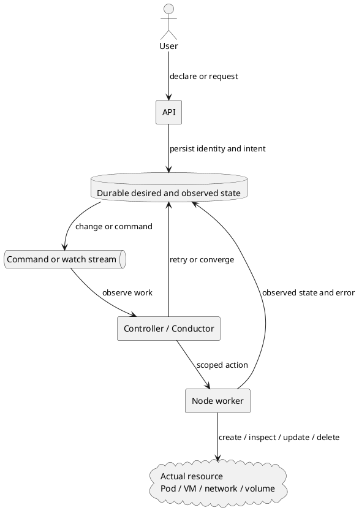

## Key takeaways

- **OpenStack and Kubernetes persist state and repeatedly reconcile toward a target instead of wrapping distributed changes in one global ACID transaction**
- **Kubernetes uses controllers that compare an API object's desired state with observed state as its central recovery model**
- **OpenStack Nova separates database state, messaging, conductor, compute workers, and periodic tasks to coordinate long-running infrastructure work with hypervisor reality**
- **Both platforms use stable identity, status, retries, ownership, leader election, and fencing without guaranteeing exactly-once execution**
- **Finalizers and TaskFlow can support cleanup and resumption but do not remove idempotency and operator recovery responsibilities around external effects**
- **Applications should design durable intent, observed state, and reconciliation rather than treating one success response as the complete truth**

## Neither platform aims for a global transaction

- **Creating a VM or placing a Pod is a long-running operation across independent components and physical resources**
  - APIs, schedulers, databases, brokers, node agents, networking, and storage participate
  - The control plane cannot hold one lock while a slow or restarting component recovers
  - Physical devices and external services do not participate in a typical database prepare-and-commit protocol

- **The solution stores intent in a durable resource instead of keeping progress on the request stack**
  - The API creates or changes a resource with stable identity
  - Workers and controllers observe the current state of their owned step
  - Failure leads to retry or an explicit error in stored state
  - A later controller, periodic task, or operator can attempt convergence again

- **Success means repeated execution converges on one final state rather than every step running once**
  - Create checks the stable ID when the target might already exist
  - Delete can complete when the target is already absent
  - Update prevents a stale version from overwriting a newer state
  - External actuation inspects what already exists and applies only the missing difference



## Kubernetes reduces desired-to-current difference

- **A Kubernetes controller watches API resources and runs a control loop that moves current state toward desired state**
  - The Deployment controller manages the required ReplicaSet
  - The Job controller can recreate Pods until the completion target is reached
  - The node controller evaluates availability through heartbeats and conditions

- **Resource name and UID provide identity for retryable operations**
  - A Kubernetes object is retrievable by group, resource, namespace, and name
  - A client can inspect that name after a create timeout
  - Controllers use owner references and labels to identify their dependent resources

- **Separating `spec` and `status` allows intent and observation to coexist**
  - A user declares desired replicas or image in the desired state
  - A controller records actual replicas, conditions, and observed generation
  - API success can mean intent was stored rather than that the resource is already ready

- **Reconciliation is repeatable difference calculation rather than one function call**
  - It avoids recreating dependent resources that already exist
  - It applies only the remaining difference after partial success
  - A stale `resourceVersion` update conflicts and requires a fresh read
  - A restarted controller rediscovers work from objects still stored in the API

- **Kubernetes does not guarantee exactly-once work**
  - Node failure or kubelet restart can start more than one Pod for the same Job index
  - A controller with a lost create response must list or get the actual result
  - A custom controller calling an external API still needs a stable external key and idempotency

## Kubernetes represents deletion and leadership as state

- **A finalizer separates a delete request from completed cleanup with a durable condition**
  - Deletion writes `deletionTimestamp`, and the API can return `202 Accepted`
  - A controller removes external load balancers, volumes, or other dependents before clearing the finalizer
  - If the controller stops, the object remains available for rediscovery

- **A finalizer marks cleanup ownership rather than executing compensation by itself**
  - The finalizer name does not contain executable code
  - Non-idempotent cleanup can duplicate effects under controller retry
  - Without conditions and events for permanent failure, an object can remain in `Terminating`

- **Lease is a time-bounded coordination object used for node heartbeat and control-plane leader election**
  - Controller replicas can elect one active leader
  - Another replica can take over after the leader disappears and its lease expires
  - External writes can still require a fencing token against a late zombie worker

- **Probes and PDBs assist reconciliation without becoming transaction boundaries**
  - Readiness reduces new traffic
  - Liveness triggers restart-based recovery
  - A PDB limits some voluntary disruptions but does not prevent OOM, node failure, or every deletion

## OpenStack Nova separates roles and state

- **Nova separates REST APIs, SQL databases, `oslo.messaging`, schedulers, conductors, and compute services in a messaging-based architecture**
  - The API validates a request, updates the database, and dispatches required work through RPC
  - The scheduler selects the compute host for an instance
  - The conductor mediates database access and coordinated work such as build and resize
  - `nova-compute` invokes the hypervisor for actual VM actions

- **Instance state is divided into VM state, task state, and power-state perspectives**
  - VM state represents the user-visible lifecycle
  - Task state represents in-progress work such as build or resize
  - Power state represents what the hypervisor observes
  - The data model allows expected database state and infrastructure reality to differ temporarily

- **Periodic tasks inspect differences between database and infrastructure state again**
  - Nova has configuration for periodically synchronizing instance power state with the hypervisor
  - Later observation can repair drift caused by transient RPC failure or external action
  - Some differences still require an `ERROR` state and operator recovery

- **The Nova conductor coordinates work without providing a global transaction**
  - Neutron networking, Cinder volumes, Glance images, and hypervisor actions retain independent failure boundaries
  - Services record step state and exceptions and perform retry, cleanup, or error transitions
  - Instance evacuation requires the source host to be fenced so one VM is not active in two places

- **Cells v2 shards databases and message queues for scale and fault isolation**
  - Cell-local conductors, computes, databases, and queues handle the cell's instances
  - One cell's communication failure has a smaller direct blast radius
  - Sharding adds cross-cell query, coordination, and operational tradeoffs

## OpenStack TaskFlow can support resumable workflows

- **TaskFlow is an OpenStack library for persisting task and flow execution results**
  - A persistence backend records history and atom inputs and outputs
  - A stored checkpoint can reconstruct an engine on another process or host
  - Tasks can define retry and revert behavior

- **TaskFlow does not automatically make every OpenStack action exactly once**
  - An external device action can succeed immediately before persistence records the result
  - Task `execute` and `revert` implementations must remain safe when called again
  - Actual persistence and recovery support depends on the adopting service and workflow

- **OpenStack still pays the operating cost of state machines and coordination**
  - VM-state and task-state combinations and allowed commands require maintenance
  - Every project implements intermediate failure and cleanup for its long-running actions
  - Operators need procedures for stuck resources, state resets, evacuation, and rebuild

## Compare the shared patterns and different abstractions

| Design element                 | Kubernetes                                        | OpenStack Nova                                    |
| ------------------------------ | ------------------------------------------------- | ------------------------------------------------- |
| Durable intent                 | API object `spec`                                 | Instance and task state in API and cell databases |
| Actual observation             | Resource `status`, conditions, and node agents    | Compute service and hypervisor power state        |
| Work delivery                  | Watch, work queue, and controller loop            | `oslo.messaging` RPC                              |
| Coordinator                    | Controller per resource                           | Conductor, scheduler, and service manager         |
| Duplicate-suppression identity | Name, UID, and owner reference                    | Instance UUID, request, and resource identity     |
| Reconciliation                 | Repeated reconcile                                | Periodic tasks, state sync, and workflow recovery |
| Deletion ownership             | Finalizer and garbage collection                  | Per-service cleanup, delete, and TaskFlow revert  |
| Active executor                | Lease-based leader election                       | Service groups, queue consumers, and host fencing |
| Fault isolation                | Namespace, node, zone, and control-plane topology | Per-cell database, message queue, and compute     |

- **Kubernetes offers a generic declarative resource control loop as a platform abstraction**
  - Custom resources and controllers can extend the same model
  - It fits resources whose desired state should remain continuously enforced

- **OpenStack Nova centers its model on VM lifecycle commands, state transitions, and separated service roles**
  - Infrastructure services cooperate on long actions such as create, resize, and evacuate
  - Not every OpenStack project uses the same internal workflow implementation

- **Both platforms model failure as observable state that later work can revisit**
  - API response and actual completion are separated
  - In-progress and error states are durable
  - Event-driven or periodic workers process the remaining difference

## Bring only reconciliation principles into applications

- **A business operation can use stable identity and target state like an infrastructure resource**

```text title="business-operation-resource.txt"
operation_id: ord-20260825-001
spec:
  desired: fulfilled
  order_id: order-001
status:
  phase: payment_unknown
  observed_version: 7
  provider_reference: pay-8421
  next_attempt_at: 2026-08-25T03:10:00Z
  condition: AwaitingProviderReconciliation
```

- **An application reconciler must not repeat a command based only on the current phase name**
  - Read both internal state and the external provider's authoritative status
  - Detect and skip effects already completed under the stable key
  - Use versioned conditional updates to avoid overwriting convergence completed by another worker
  - Expose a reason and manual command after exhausting the retry budget

- **Cancellation can adopt an explicit cleanup boundary similar to a finalizer**
  - Separate cancellation requested from refund and inventory-release completed
  - Enter a terminal state only after all required cleanup is confirmed
  - Show customers the difference between accepted cancellation and completed cancellation

- **Reduce platform patterns to the scale of the domain instead of copying them wholesale**
  - A request completed in one database transaction does not need a controller framework
  - A low-throughput asynchronous job can use one operation table and scheduler
  - Consider a workflow engine only as external systems, timers, branches, and execution duration grow

## Conclusion and recommended actions

- **OpenStack and Kubernetes handle failure by preserving stable identity and durable state for repeated reconciliation rather than by eliminating failure**
- **Their controllers and conductors do not solve payment or order consistency for the deployed application**
- **Applications should establish local transactions and idempotency first, then add status and reconciliation only around boundaries with ambiguous outcomes**
- **A custom controller or orchestrator must prove duplicate-safe create, observe, update, and delete behavior and fencing against stale workers before deployment**
- **Operations must monitor stale progress, reconciliation latency, repeated failure, and manual-recovery inventory in addition to success rate**

## References

- [Kubernetes controllers](https://kubernetes.io/docs/concepts/architecture/controller/)
- [Kubernetes API concepts](https://kubernetes.io/docs/reference/using-api/api-concepts/)
- [Kubernetes finalizers](https://kubernetes.io/docs/concepts/overview/working-with-objects/finalizers/)
- [Kubernetes Leases](https://kubernetes.io/docs/concepts/architecture/leases/)
- [Kubernetes Jobs](https://kubernetes.io/docs/concepts/workloads/controllers/job/)
- [OpenStack Nova system architecture](https://docs.openstack.org/nova/latest/admin/architecture)
- [OpenStack Nova VM states and transitions](https://docs.openstack.org/nova/latest/reference/vm-states.html)
- [OpenStack Nova configuration reference](https://docs.openstack.org/nova/latest/configuration/config.html)
- [OpenStack Nova Cells v2](https://docs.openstack.org/nova/latest/admin/cells.html)
- [OpenStack TaskFlow persistence](https://docs.openstack.org/taskflow/latest/user/persistence)
- [OpenStack Compute API server evacuation](https://docs.openstack.org/api-ref/compute/)
