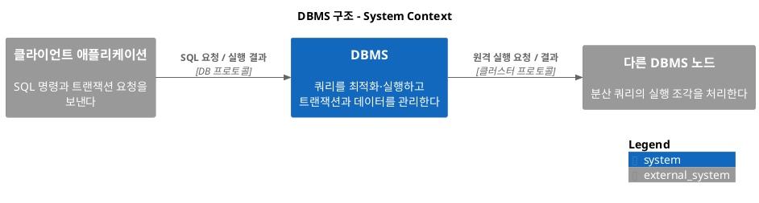
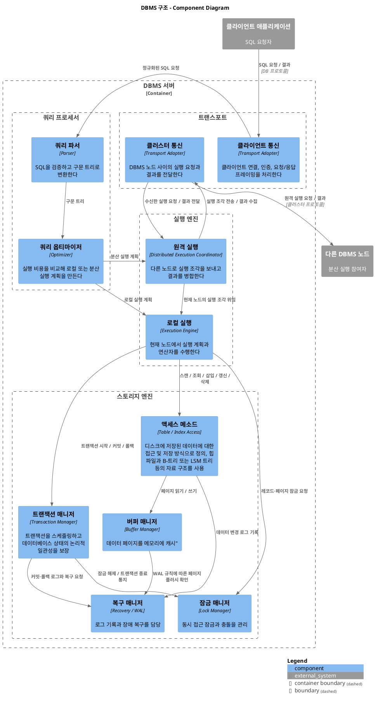

# 1부. 스토리지 엔진

데이터베이스 관리 시스템(DBMS, Database Management System)의 주목적은 데이터를 안정적으로
저장하고 사용자에게 제공하는 것이다.

- 데이터베이스는 모듈식 시스템
  - 요청을 전달하는 전송 계층
  - 가장 효율적인 쿼리 실행을 계획을 결정하는 쿼리 프로세서
  - 실제 작업을 수행하는 실행 엔진 그리고 스토리지 엔진으로 구성됨

- 스토리지 엔진은 DBMS에서 데이터를 메모리와 디스크에 저장
  - 검색 및 관리하는 소프트웨어 컴포넌트
  - 각 노드에 데이터를 영구 저장함
  - 복잡한 쿼리를 수행할 수 있도록 데이터를 세밀하게 조작할 수 있는 간단한 API를 제공함
- 사용자는 스토리지 엔진을 사용해 레코드를 CRUD를 할 수 있음

# 1장. 소개 및 개요

**1. System Context**

**2. Component**

## 인메모리 DBMS 대 디스크 기반 DBMS

- 인메모리 DBMS는 메모리에 데이터를 저장하고 디스크는 복구와 로그 저장 용도로 사용
- 디스크 기반 DBMS는 데이터를 디스크에 저장하고 메모리는 캐시 또는 임시 저장 용도로 사용
- OS의 메모리 추상화를 통해 개발자는 임의의 메모리 청크를 할당하고 해제하는 작업 정도로 메모리를 간단하게
  제어 가능함. 반면 디스크는 데이터 참조와 직렬화 포맷 설정, 메모리 해제, 메모리 단편화 등의 이슈를
  모두 직접 관리해야함

## 데이터 파일과 인덱스 파일

- DBMS는 데이터 파일과 인덱스 파일을 분리함
- 대부분의 최신 DBMS는 데이터를 즉시 페이지에서 삭제하지 않고 대신 키와 타임스탬프등의 삭제
  관련 메타데이터를 저장한 삭제 마커(delete marker, tombstone)를 사용함
- 수정되거나 삭제 마커로 가려진(shadowed) 레코드는 가비지 컬렉션 중에 최신 레코드로 갱신

### 데이터 파일
